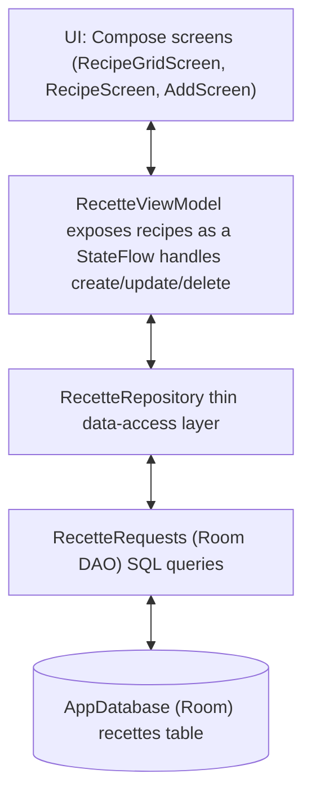
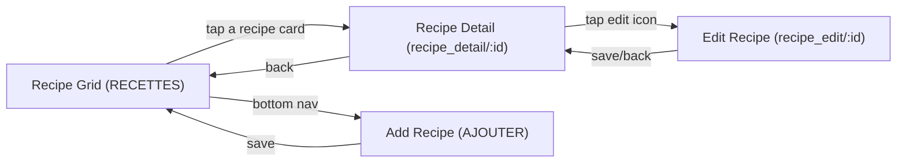

#  Cooking Book

*Personal project, August 2026*

A personal recipe notebook Android app, built natively with **Kotlin** and **Jetpack Compose**. Cooking Book lets you save, browse, filter, and share your own recipes. No account, no backend, everything stays on your device.

The visual reference was created on Emergent and used a React Native/Expo mockup, then the project was rebuilt from scratch as a native Kotlin/Android app.


## 📖 Preview
## 🧩 Features
- **Recipe grid:** browse all your recipes in a 2-column grid, with photo, category, total time, and servings at a glance.
- **Search:** instant title search with an inline results dropdown.
- **Category filter:** filter the grid by category via a horizontally scrollable chip row.
- **Ingredient filter:** filter recipes by one or more ingredients through a dedicated bottom sheet, with a live selection count badge.
- **Add/Edit recipes:** a single form handles both creating a new recipe and editing an existing one: photo, title, category, servings, prep/cook/rest time, a dynamic list of ingredients, a dynamic list of preparation steps, and free-form notes.
- **Recipe detail:** full-screen hero image, time and servings breakdown, ingredient list, numbered preparation steps, and a notes section.
- **Delete recipes:** with a confirmation dialog before anything is removed.
- **Share recipes:** export any recipe as a **PNG** or a **PDF** and share it through the system share sheet, or open it directly with a compatible app.

## 🛠️ Tech Stack
- **Kotlin + Jetpack Compose:** 100% Compose UI, no XML layouts.
- **Room:** local persistence, with [Ingredient]/[Preparation] lists stored as JSON via custom [TypeConverter]s.
- **Kotlin Coroutines&Flow:** reactive data layer; the UI observes a [StateFlow] of recipes and recomposes automatically on any change.
- **Navigation Compose:** single-activity graph (recipe grid, detail, add, edit).
- **Coil:** async image loading for recipe photos.
- **Material3:** theming, components, and a custom color/typography design system layered on top.
- **PdfDocument/FileProvider:** native PDF and PNG export, shared through a [content://] URI (no third-party PDF library).

## 🗂️ Architecture
The app follows a simple **Model-View-ViewModel (MVVM)** structure:

Dependency injection is done manually (no Hilt/Koin yet, see "Future improvements"): the database, repository, and a [ViewModelProvider.Factory] are wired together once in [MainActivity] and shared across the whole navigation graph via a single [RecetteViewModel] instance.

## 🔀 Navigation flow


## 🗃️ Project structure
```Bash
ui/
  |---- components/ # Reusable composables (cards, inputs, buttons, dialogs, ...)
  |---- data/ # Room entities, DAO, repository, converters
  |---- icons/ # IamgeVector icon definitions
  |---- models/ # ViewModels
  |---- screens/ # Top-level screens (grid, detail, add/edit)
  |---- theme/ # Design tokens: colors, spacing, radius, typography
  |---- utils/ # Small shared utilities (e.g. Compose-to-bitmap)
  |---- MainActivity.kt
```

## 💽 Getting started
1. Clone the repository:
```Bash
git clone https://github.com/flaviecousin/Cooking_Book.git
```
2. Open the project in **Android Studio** (Hedgehog or later recommended).
3. Let Gradle sync, then run the app on an emulator or a physical device (min SDK: *fill in your [minSdk]*).

No API keys, no environment variables, and no backend setup required. The app works fully offline out of the box.

## 🎨 Design
The visual identity leans towards editorial and warm: cream backgrounds, deep aubergine text, and a raspberry pink accent, paired with a serif display font for titles and a monospace-style font for body text. See [ui/theme/] for the full set of design tokens (colors, spacing, corner radius, typography).

## ©! Credits
- Icons adapted from *composables.com/icons*, converted to Jetpack Compose [ImageVector]s.
- Fonts: *Playfair Display* and *DSE Typewriter* (check each fonts's license before any commercial use.

## 🔭 Future improvements
- Using Hilt with Room instead of manual dependency injection
- Creating the category inside the app and not in the code
- Creation of a new screen: integrated shopping list. Add an icon on each recipe to add all of its ingredients to a groceries list. The list screen show the consolidated ingredients (checkable one by one while shopping) plus, at the bottom, the recipes that contributed to it (with the option to remove a recipe (and its ingredients) from the list).
- Adding a feature in the AddScreen where you can add a picture to
- Auto-fill from picture/PDF/URL: let users import a recipe from a photo, a PDF, or an URL, and automatically extract and fill in the title, ingredients, steps, and other fields instead of typing theme manually.


## 📜 License
This code in this repository is licensed under multiple licenses. Feel free to use it as a reference, but please don't republish it as your own portfolio piece.
This project uses third-party icons and fonts, which remains under their own original licenses:
- Icons adapted from [composables.com/icons](https://composables.com/icons), sourced from various open-source icon sets (Feather Icons, Bootstrap Icons, Heroicons, Radix Icons, Phosphor Icons, Fluent UI System Icons, VS Codicons, Lucide. *Check each set's original license before reuse.*
- Fonts: Playfair Display (SIL Open Font License) and DSE Typewriter. *Verify DSE Typewriter's license terms in [app/src/main/res/font/LICENSE.md]
